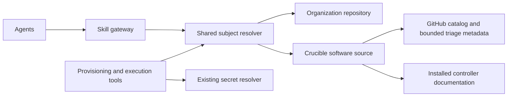

# Subject-based skill gateway

Status: implemented local review draft for issue #1118. Runtime activation and
publication are pending review. The initial subject is `harness/crucible`.

## Goal and first release

Give agents one retrieval contract for the knowledge relevant to a subject.
For Crucible, this combines administrator-maintained organization guidance with
documentation from the installed Crucible controller. Organization guidance is
available to all users of an agentic-perf instance. A future user source applies
only to the authenticated user associated with a ticket.

Use administrator-configured organization sources outside the public
repository. The first release supports one or more local paths or Git URLs; a
single-source shorthand keeps the common setup simple. Anonymous HTTP or
HTTPS reads need no per-user GitLab identity when the repository is reachable
and permits unauthenticated reads. Authenticated Git access uses either the
instance's existing OpenSSH identity/agent or a secret reference resolved by
the existing secret provider. Implement organization scope first; reserve
user and project extension points without enabling them prematurely.

The recommended first migration includes both guidance and structured Crucible
runtime configuration. The draft includes this scope; a documents-only configuration
can explicitly retain legacy settings temporarily. Secret values continue through
the existing secret providers.

## New-developer onboarding acceptance

Before this work is ready to merge for team use, an agentic-perf installation
with network access to the organization repository must be able to start from a
clean install, configure the repository URL once, and use the integrated
subject without manual cloning or extra subject-specific setup. For an
unauthenticated source, repository visibility and network access provide the
read boundary. For a private repository, its read credential is configured
once for the installation. The repository is separate from the public
agentic-perf checkout and is maintained by the organization.

The acceptance check must verify that one `skill_gateway.organization.source`
setting discovers a repository's subjects and their paired documents and
service configuration. An instance can also configure a named `sources` list
when independent teams maintain separate repositories. A clean Crucible ticket
must obtain its organization context through the gateway. The developer must
not need to copy private documents into `private-skills`, add per-subject source
entries, edit prompts, or obtain undocumented instructions from the
administrator. Each Git URL and ref is configured once; credentials, when
needed, are referenced from the existing secrets provider and never stored in
agentic-perf configuration.

For SSH URLs, the source uses the existing OpenSSH identity and known-hosts
configuration with strict host-key checking. An administrator may instead
reference an SSH private-key secret. HTTPS token authentication uses a secret
reference and a short-lived askpass helper; credentials are not placed in the
URL, process arguments, Git configuration, or logs. Team onboarding is not
complete until the private repository is hosted in an organization-controlled
location, read access is available to another developer, and the clean-install
acceptance check succeeds.



## Baseline before this migration

- Benchmark and review register `get_crucible_benchmark_context`, whose current
  MCP implementation calls `controller_context_gateway` in
  `agents/server_utils.py`. Its bootstrap reads the controller's `AGENTS.md`,
  then agents follow documentation pointers using bounded reads and searches.
- The older `CrucibleContextGateway` provider has a manifest-backed
  `LocalContextSource`, but that adapter is not the organization overlay for
  the current controller-direct MCP tool. `skills/context-manifest.json` also
  has no entries.
- The Crucible benchmark agent excludes legacy `read_skills` and repository
  lookup tools. Review still advertises `skills/crucible/*.md`, exposes
  `read_skills`, and requests local skills in its prompt.
- `PrivateSkillProvider` reads instance-wide JSON from `PRIVATE_SKILLS_DIR`,
  normally `$AGENTIC_PERF_HOME/private-skills`. Provisioning tools consume
  sections such as `provisioning`, `constraints`, `platform_contract`, and
  `install_contract` directly. Review also reads configuration through this
  provider. This directory is not scoped to the ticket submitter.
- Workspace snapshots accept only `github`, `controller`, and `local` source
  names. Document indexes use `(ref, source)` and an effective manifest is
  stored at one common path. Organization snapshots in this draft therefore use a separate service-only
  namespace; the software workspace adapter retains its existing identities.
- Tickets have server-recorded `created_by` and an owners list. The existing
  secret cascade already supports user, group, and deployment providers.

The migration must connect the active controller path, the organization package,
and configuration consumers. Renaming the existing tool alone will not do this.

## Subject, scope, source, and authority

These are separate concepts:

| Concept | Meaning | Initial example |
| --- | --- | --- |
| Subject | Stable topic requested by an agent or configured by an administrator | `harness/crucible` |
| Scope | Who owns guidance and whom it applies to | Organization; future user/project |
| Source | How the gateway obtains material | Configured directory or Crucible controller |
| Role | How to use the material | Operational guidance, software reference, runtime configuration |
| Revision | Exact material used by a ticket | Content digest; future repository commit |

Subject identifiers are exact registered names with a namespace and name.
Other examples are `harness/zathras` or `domain/networking`. A subject is a
topic, not a filename, a source URL, or a classification inferred from a file's
name. Internal benchmark ownership remains explicit metadata when necessary.

### One benchmark can require several software sources

Do not treat a guidance subject as the complete software-source selection. A
Crucible run of uperf can need all of the following, with different roles:

| Source | What it establishes |
| --- | --- |
| Crucible core documentation on the selected controller | Run-file structure, endpoint semantics, and installed behavior |
| The controller's `subprojects/benchmarks/uperf/` integration checkout (`bench-uperf`) | Which parameters and roles Crucible exposes for uperf, and how the integration starts its engines |
| Native upstream uperf documentation, when needed | uperf's own workload and program behavior, independent of Crucible's run-file contract |
| Organization or user guidance for `harness/crucible` or `benchmark/uperf` | Operational preferences owned by that scope; it does not define software capabilities |

For a Crucible uperf run, retrieve the Crucible integration documentation even
if `get_skill_context(subject="benchmark/uperf")` reports that no guidance
package is configured. That status says nothing about whether uperf or its
Crucible integration has software documentation. In particular, Crucible's
`bench-uperf` metadata defines the accepted Crucible `mv-params`; native uperf
options or workload syntax are not substitutes for those fields. Generic
Crucible examples describe possible run-file patterns, not requirements for
every benchmark.

The installed `bench-uperf` README specifically documents that, for Crucible
`remotehosts`, server `ifname` selects the data-plane interface and Crucible
shares its service address with clients; omit client `remotehost` in that
mode. The generic Crucible multi-pair example uses `remotehost` to illustrate
per-engine scoping, which is easy to overgeneralize. Review that example as an
upstream documentation follow-up: label its parameter as benchmark-specific or
use a clearly identified uperf example. Do not turn `ifname` into a universal
Crucible parameter; it is benchmark-specific too.

The first implementation can follow the controller `AGENTS.md` pointer and
read the installed integration files by path. It does not yet bind native uperf
documentation as a runtime software source. Add an explicit source mapping
before claiming that `benchmark/uperf` bootstrap retrieves those native docs;
keep its source identity and revision distinct from the controller integration
checkout.

The gateway obtains ticket identity, agent, phase, scope, and source permissions
from server configuration and authenticated ticket state. The model supplies
the subject and its document request. It cannot supply another user's identity,
an organization source root, repository credentials, or a different deployment.

The instance configuration grants organization scope. A manifest cannot grant
itself a different scope or claim another user. Phase and agent selectors control
relevance within that scope; authorization is enforced separately.

## Administrator configuration

Configure one organization source for the simple case. When sources are
maintained independently, configure a named `sources` list. Each repository
uses the same subject directory layout, and the gateway discovers the union of
subjects without per-subject location settings. Local paths remain available
for development; Git URLs let developers use shared private repositories:

```json
{
  "skill_gateway": {
    "organization": {
      "sources": [
        {
          "id": "crucible",
          "kind": "git",
          "url": "https://git.example.com/performance/crucible-skills.git",
          "ref": "main",
          "auth": {
            "kind": "https-token",
            "username": "oauth2",
            "secret_ref": "organization/agentic-perf-skills-read-token"
          }
        },
        {
          "id": "zathras",
          "kind": "git",
          "url": "ssh://git@git.example.com/performance/zathras-skills.git",
          "ref": "main"
        }
      ]
    }
  }
}
```

Subjects are discovered from the union of `skills/<namespace>/<name>/skill.json`
and `service-config/<namespace>/<name>.json` descriptors. A subject can provide
documents, service configuration, or both. The directory layout binds a stable
subject such as `harness/crucible`; manifest subjects are checked before their
content is used. No per-subject instance entry is needed for the common case.

The optional `organization.subjects` map retains explicit per-subject exceptions
and migration choices. Supplied fields refine a discovered binding; omitted
fields are inherited. For example, `{"required": false}` changes only that
subject's required policy. When more than one source contains a subject,
source-specific overrides must identify `source_id`. An explicit `source` or
`service_config` changes the corresponding path; an explicit null removes that
counterpart, provided the subject retains another source.
Selecting `legacy_config: true` removes the discovered
service configuration unless a non-null one is explicitly supplied, which is an
invalid conflict. These are binding overrides, not merges of settings values.
The repository's `organization.required` policy defaults to `true`.

The administrator configures the source once for the instance. All workers fetch
the configured branch and resolve it to a commit before discovering subjects.
The service reads the source; ordinary ticket submissions and user settings
cannot replace this configuration. Local-path sources must be readable by all
workers. Git checkouts are held in a private service cache outside ticket
workspaces.

An explicitly configured required source that is missing, unreadable, invalid,
or inconsistent with its declared subject is an error before the affected
operation runs. A missing or unreadable configured repository is reported as an
error, rather than an empty successfully discovered catalog. A configured root
with no eligible subjects is also an error. An unconfigured
source is a distinct state. A fresh installation
can retrieve available software documentation without an organization package;
operations requiring organization runtime settings report missing configuration.

The Git source accepts HTTP and HTTPS URLs, `ssh://` URLs, and standard
`user@host:path` SSH clone URLs, with branch refs. It rejects embedded
HTTP(S) credentials, query strings, fragments, and other URL schemes. HTTP
and HTTPS can be used for anonymous reads when the repository permits them.
Plain HTTP is unencrypted and should only be used when the network is the
intended access boundary. HTTPS tokens and optional SSH private keys use
administrator-managed secret references from the
existing secrets provider. A private-key secret must be usable
non-interactively; passphrase-protected keys can use the existing SSH agent.
SSH may instead use the service account's existing OpenSSH identity/agent and
known-hosts file; strict host-key checking is enabled. The local cache stores
mirrors and independent,
immutable commit checkouts under service storage with restricted directory
permissions. Each agent provider initialization refreshes the configured
branch; the exact commit and content snapshot stay server-side, and existing
ticket pins remain stable. Git source discovery is deferred by offline
`config show`; the first provider initialization reports fetch or authentication
failures as required source errors. A remote skill source does not clone
Crucible software repositories during catalog discovery.

## Organization repository and packages

A repository separates model-readable packages from service-only configuration:

```text
organization/
  skills/
    harness/
      crucible/
        skill.json
        SKILL.md
        provisioning.md
        benchmark.md
        review.md
        references/
          practices.md
  service-config/
    harness/
      crucible.json
```

`skill.json` declares a schema version, the subject, entrypoints, the documents
that belong to the package, and applicable phases. It cannot select a runtime
configuration path. The configuration subject and manifest subject must agree.
Scope comes from the administrator's repository or explicit source binding.
The package's directory name determines its discovered subject, independently
of the skill's display name. Service configuration is never a supporting skill
file or an implicitly exposed repository resource.

For example:

```json
{
  "schema_version": 1,
  "subject": "harness/crucible",
  "documents": [
    {"path": "SKILL.md", "entrypoint": true},
    {"path": "provisioning.md", "entrypoint": true, "phases": ["provisioning"]},
    {"path": "benchmark.md", "entrypoint": true, "phases": ["benchmark"]},
    {"path": "review.md", "entrypoint": true, "phases": ["review"]},
    {"path": "references/practices.md", "phases": ["review"]}
  ]
}
```

Supported runtime schemas are registered contracts; the package does not select
executable validators or load arbitrary code.

The document inventory is explicit and independent of filenames. A supporting
document can be restricted to a phase. Benchmark-specific applicability is a
future metadata extension.
An owned document is never hidden because its filename does not contain a
relevance keyword. A configured source root and validated relative paths enforce
containment, including symlinks.

`SKILL.md` explains the organization workflow and points to phase-specific
guidance. The gateway exposes the applicable entrypoints and supporting
documents. Agents read the material needed for their current task through the
gateway, rather than receiving every document in their initial prompt.

The discovered or explicitly bound service JSON contains validated settings used by the installation,
execution, and review services. Existing tool-side contracts continue to read
structured data; the agent does not translate prose into installation settings.
The raw resource is excluded from document inventory, search, and arbitrary
model-facing reads. A documents-only discovered subject has no service settings;
it does not silently fall back to legacy JSON. A config-only subject supplies
service settings without organization document entrypoints; applicable software
references remain available. Model-facing configuration views require a
registered projection schema, initially provided for `harness/crucible`. An explicit
`legacy_config: true` documents-only binding retains legacy runtime
loading rather than pinning those legacy settings; the coherent configuration
pin requires `service_config`. The gateway can return configuration-view references for
explicitly approved sections/fields needed by the current agent. Reading a view
returns validated JSON from the canonical revision. It never returns the entire
private configuration file or arbitrary keys selected by the model. Secret
bindings contain references only. Resolved secret values never enter skill
document responses or context snapshots.

Keep examples and schemas in the public repository free of organization-specific
content. The actual package stays in the configured private path or future
private repository.

## Gateway operations

Use one shared tool definition, provisionally `get_skill_context`, for example:

```json
{"subject":"harness/crucible","operation":"bootstrap"}
{"subject":"harness/crucible","operation":"read","ref":"<returned-ref>"}
{"subject":"harness/crucible","operation":"search","query":"ethtool|multiplex"}
```

Bootstrap returns the applicable organization entrypoints and, when available
for this phase, the software entrypoint. It reports each source's availability.
Provisioning can bootstrap organization guidance before a controller exists.
Benchmark and review can additionally bootstrap the controller's `AGENTS.md`.
Required installed-runtime information remains a prerequisite for operations
that depend on it; missing controller context does not become an inferred schema.

Returned references are stable logical identities and round-trip directly into
reads. Organization and software documents cannot collide even if both are
named `AGENTS.md`. To follow a relative pointer inside a document, allow a
relative path together with the originating document reference. The gateway
resolves it mechanically inside that document's source root. The agent retains
responsibility for interpreting the documents and choosing follow-up reads.

Bootstrap can also identify approved configuration views for the current phase,
such as execution defaults or review settings. Existing config-display tools can
delegate to the same resolver during migration; Crucible prompts eventually use
the generic gateway views. Installation/execution services consume the full
validated runtime configuration directly through the resolver.

Read responses use the existing bounded byte paging. Search covers only the
current subject's applicable document inventory and returns references, snippets,
and sizes. Results identify the scope and role needed to interpret guidance;
physical paths, credential references, and transport details stay server-side.

Use a shared gateway implementation and MCP tool registration for every consuming
agent. A ticket-scoped MCP server is a suitable initial host, using the existing
`connect_ticket_server` and audit infrastructure. Software adapters retain the
current Crucible controller and bounded catalog behavior. A catalog of available
subjects supports administrator diagnostics and agent subject discovery without
claiming that every harness already has a software adapter.

### GitHub retrieval during triage

`harness/crucible` retains both upstream and installed-software sources. Triage
uses the existing bounded GitHub/repository-file retrieval for the Crucible
catalog and the benchmark metadata needed to identify suites, roles, host
requirements, and basic supported parameters. It requires neither a controller
nor a local Crucible checkout, and does not clone or refresh Crucible repositories.

Existing triage tools such as `list_benchmarks`, `resolve_benchmark`, and
`get_benchmark_details` retain their structured interfaces. Their Crucible
catalog provider uses the subject's software adapter and shared resolution
contracts; agents do not need to replace benchmark discovery with raw document
reads. Upstream files can be cached with their own revision/provenance without
being treated as installed-runtime truth.

Organization guidance is an additional source for the same subject. It does not
replace the upstream catalog or the controller's documentation. Provisioning
uses applicable organization guidance/configuration; benchmark and review use
the controller for execution-compatible software facts after provisioning.
The phase and operation determine the appropriate software source. A missing
controller is not a reason to substitute upstream metadata for runtime facts
required to validate or execute a run.

## Priority and conflicts

Use locality as an informative default for contextual claims and preferences,
not as a universal authority ordering. Upstream context supplies baseline
knowledge. Organization context is more local to the shared deployment and
normally carries more weight for environment-specific procedures and defaults.
Authenticated user context, when configured, is more local to that user and
normally carries more weight for that user's preferences. Ticket text gives
task-specific intent and can guide choices among soft defaults. Each source
must still be evaluated for the scope of the claim it makes.

| Content | Resolution rule |
| --- | --- |
| Verified software/runtime facts | Runtime evidence and version-matched software documentation establish supported behavior. General upstream or local prose cannot change a schema or installed capability. |
| Upstream context | Baseline knowledge, including general product and benchmark information. Use version-matched authoritative documentation for software behavior. |
| Organization context | Applies to users of the configured instance. Normally takes precedence over upstream defaults for local procedures, environment details, and preferences. |
| Authenticated user context | Applies only to that user's tickets. When available, normally takes precedence over organization defaults for personal preferences, unless those conflict with mandatory organization policy or verified behavior. |
| Ticket guidance | Describes the current task and may select among compatible soft defaults or clarify which scoped source applies. It cannot waive mandatory policy or alter software capability. |
| Hard requirements | Enforce through validated configuration or code. A Markdown instruction by itself is not a security or correctness boundary. |

This feature implements multiple organization sources and the installed
software/documentation source. Authenticated user-level skill sources are a
future layer; the locality rule above defines the intended resolution behavior
when they are added, and does not imply they are loaded today.

Project scope is a future extension. Resolve project-specific defaults and
requirements explicitly when implementing it; do not bake the previous
conversation's tentative project/user ordering into the first release.

Documents remain distinct with scope, source id, revision, and role metadata.
Arbitrary prose is not deep-merged. The gateway identifies exact duplicate
documents and same-path documents with different content; it does not claim to
detect every semantic contradiction. Ticket agents compare all applicable
entrypoints across sources using ticket-specific trust guidance, verified
software behavior, and mandatory organization policy. Locality may help resolve
conflicts across levels for soft defaults, but sources at the same level have
no implicit winner. If a material same-level conflict (such as conflicting
organization repositories) or other material conflict remains unresolved, the
agent raises HITL and identifies the competing source ids and document paths.
Repository order and source id never decide authority. Multiple distinct
runtime configurations for one subject are exposed as a configuration conflict
and cannot be silently merged or selected; the administrator must configure
an explicit source choice before runtime consumers proceed.

## Revisions and workspace persistence

Pin the organization package's documents and runtime configuration together
for the ticket lifetime at first use, before installation or execution consumes
configuration. The initial implementation uses a server-owned `initial` binding
for every phase of that ticket; the ticket model has no cross-phase attempt ID. Record a content digest and a source identifier. Later phases
use that same revision, even if the administrator updates the source directory.
New tickets use the new revision. There is no refresh for an existing ticket
in the first implementation. A later trusted attempt/refresh mechanism must
account for validations and approvals that relied on previous settings.

Adding a document/configuration counterpart under the same repository root
affects new captures; existing tickets retain their pinned snapshot. Changing
an explicit source binding or Git URL/ref is an error for an existing pin.
Removing a pinned subject's binding reports unavailable rather than selecting
legacy settings for that ticket.

Controller/software context keeps its existing phase-appropriate refresh rules.
Organization and controller revisions can be effective at the same time because
they serve different roles. Preserve both rather than treating one as an
alternate of the other.

Extend workspace identities to include subject, source identifier, revision,
document reference, phase, and audience. Subject-qualified manifests must coexist
without overwriting the effective context of another subject. Reads and searches
must resolve the authorized pinned revision, including through native workspace
tools. Store raw configuration snapshots in service-only persistence bound to
the same revision. Approved configuration views can be persisted as visible
resources. Native workspace reads must not expose raw configuration through a
guessed path; omitting it from the document list alone is insufficient.

Record resolution, revision, unavailable-source status, and document access in
the existing audit system. Gateway and tool-side config consumers must use the
same organization revision. Follow the audited filesystem and side-effect
inventory requirements when adding persistence.

## Future user scope and secrets

User settings will map the same subject identifier to a source owned by that
user. Access is self-or-admin, following the existing authentication model.
The gateway should obtain the user from authenticated ticket state, using
`created_by` where it represents a real user. An owners list, comments, model
arguments, or a worker's operating-system home must not choose the user layer.
Legacy/service-created tickets need an explicit identity rule before user
sources are enabled.

A future local user source must be inside a permitted user-owned root or uploaded
through an authenticated interface. A user-configured arbitrary server path
must not grant access to service-readable private files. User context isolation
must also cover persisted workspace material, shared tickets, cross-ticket
references, and artifact APIs. These are prerequisites for adding user scope.

Reuse the existing cascading secrets provider, which already has user, group,
and deployment layers. Service-only configuration can also point directly to
Git-backed secret files with `git-secret+http://`, `git-secret+https://`, or
`git-secret+ssh://` references that include their repository, branch, and path.
Secret values remain
resolved inside services for a specific operation and never enter
model-readable context documents.
User-owned remote secret sources and conflict handling across secret scopes
remain future work. Tests can establish the resolver boundary; they cannot
guarantee that an administrator never writes a credential into arbitrary
Markdown.

## Crucible migration map

Classify individual rules and sections before assigning a destination. A file's
current location does not establish who owns its content. In particular, a file
under an operating-system user's home directory is not evidence that its settings
should apply only to that agentic-perf user.

| Current source | Proposed destination or consumer |
| --- | --- |
| `agents/provisioning/prompts/crucible.md` | Organization installation choices; software facts move to upstream references; agentic-perf tool/workflow contracts stay in prompts or code |
| `agents/benchmark/prompts/crucible.md` | Organization benchmark defaults and practices; software facts move to upstream references; gateway/tool protocol and execution contracts stay in prompts or code |
| Crucible sections in review/base prompts | Organization review practices where applicable; software facts move to upstream references; common reasoning stays in agent prompts |
| `skills/crucible/*.md` | Section-level classification: upstream software references, organization practices, confirmed personal preferences, or agentic-perf contracts; remove redundant copies after replacement coverage is available |
| Legacy private harness guidance | Classify by meaning and intended audience; organization or user documents only where that ownership is established |
| Legacy private harness settings | Validated runtime config consumed through the same package resolver, implemented in this first slice |
| Secret references in private settings | Service-consumed bindings to the existing secret resolver |
| Controller `AGENTS.md`, schemas, benchmark/tool docs | Crucible software adapter inside the skill gateway |
| Triage catalog discovery | Existing small catalog provider; it does not become a full controller bootstrap |

The eight baseline public Crucible documents were `benchmark-discovery.md`,
`cdm-query-guide.md`, `kube-endpoints.md`, `result-parsing.md`,
`review-methodology.md`, `run-file-pitfalls.md`, `tool-params.md`, and
`userenv-guide.md`. Audit each document's advice against current prompts and
installed-source responsibilities before moving it. Consolidate duplicates and
resolve contradictory result-retrieval guidance. Prefer pointers to authoritative
software documentation for software facts; preserve useful compatibility
guidance with its reason and provenance.

### Content audit and upstream documentation

Keep organization and user skill details, private configuration findings, and
the detailed migration inventory outside the public Git repository. Do not
include those details in GitHub issues, pull requests, comments, or attachments.
Public discussion covers gateway contracts, generic examples, and upstream
software documentation changes. Review proposed public text against this
boundary before posting it.

The first planning deliverable is a private inventory covering the eight public
documents, Crucible fragments in agent prompts, and existing private settings.
Keep that inventory outside this repository. For each rule or section, record:

- Current file/section and the phases/tools that actually consume it.
- Whether it describes software behavior, an organization practice, a personal
  preference, an agentic-perf contract, or a structured runtime setting.
- An upstream documentation reference and revision, or an explicit coverage gap
  after inspection. Do not infer upstream coverage from local filenames.
- Proposed destination, duplicates/conflicts, and the condition for removing
  the current copy.

Software behavior belongs in Crucible or its owning subproject's documentation.
When upstream already explains it, use gateway references and remove redundant
prose. When upstream coverage is missing or unclear, prepare an upstream
documentation change rather than making the organization skill its permanent
home. This includes run-file schemas, tool parameter formats, userenv mechanics,
and result/metric API behavior. Version-sensitive workarounds need a reason,
affected version, and removal condition if temporarily retained locally.

Check both upstream GitHub coverage and the documentation available on installed
controllers. A newly merged upstream change does not imply that existing
controllers provide it. Remove required local guidance only when the gateway can
retrieve its replacement in the phases and supported installations that need it.

Organization documents capture shared choices such as a measurement baseline,
installation settings, and agreed review practices. User documents capture
confirmed personal preferences; do not invent user-level content merely to fill
that scope. Agent prompts retain role responsibilities and necessary tool/workflow
instructions. Enforced execution and authorization constraints remain in code.

Reconcile conflicts explicitly in the private inventory and agree on the
intended behavior before including the affected guidance in the private package.

Migrate all relevant consumers together: triage/provisioning/benchmark/review
prompt construction, shared tool registration, tool scoping, config loading,
workspace references, audits, and diagnostics. Remove Crucible review's local
skill enumeration and legacy skill-reading path after gateway parity is ready.
Keep existing legacy behavior for other harnesses until their subjects are
implemented.

Keep runtime configuration findings in the private migration inventory. Migration
must inventory its keys securely and validate them against current consumers;
the public sample is not a substitute for this check. Provide a migration preview
and an external package destination. Keep the old file during cutover so the
administrator can review the migrated result. For one configured subject, select
one canonical config source; do not silently deep-merge a new organization
package with stale legacy settings. Any temporary legacy fallback is explicit
and reported in diagnostics.

## Implementation status and rollout acceptance

This local review draft implements the path and Git organization sources,
subject discovery, gateway retrieval, and Crucible software adapter described
above. Git accepts HTTP, HTTPS, and SSH branch URLs. Authentication can use the
existing OpenSSH identity/agent, an HTTPS token secret reference, or an SSH key
secret reference. Git fetches run through the audited subprocess provider;
cache checkouts are independent of the mutable mirror, and ticket snapshots
retain their pinned content. Configuration diagnostics validate Git descriptors
offline and report only the host, ref, and authentication method. Runtime
activation, a hosted private organization repository, and team onboarding remain
pending review.

Required checks before team rollout include:

- Configure once, and obtain the same organization subject/revision for tickets
  from different users; model-supplied identity or paths cannot alter the source.
- Discover document-only, configuration-only, and combined subjects across
  multiple source roots; adding a subject does not require a per-subject source
  entry.
- Preserve source ids and revisions in document references. Return all
  same-subject entrypoints, identify exact duplicates and same-path variants,
  and ensure source ordering never selects a winner.
- Verify that ticket-specific trust guidance can inform runtime resolution,
  while unresolved material conflicts can raise HITL with both source ids and
  document paths. Conflicting service configuration must fail explicitly.
- Keep explicit subject binding overrides and report discovery failures.
- Bootstrap organization guidance without a controller; retrieve software docs
  when the phase has a controller; report required-source failures explicitly.
- Preserve existing controller entrypoint traversal, paging, search, path
  containment, and triage's bounded/no-clone catalog behavior.
- Keep subjects, scopes, same-named documents, phases, and revisions distinct in
  gateway and workspace retrieval, including cache hits and handoffs.
- Make source content updates affect new tickets while current tickets retain their
  pinned organization docs and tool configuration.
- Exercise provisioning and review against the new config source without losing
  settings or consulting stale private JSON after cutover.
- Verify that service-only config and resolved secret values are absent from
  document responses, document searches, and model-readable snapshots.
- Check audit/side-effect inventories and ensure other harnesses retain their
  existing prompt, tool, and private-config behavior.
- Accept valid HTTP, HTTPS, and SSH branch sources; reject embedded HTTP(S)
  credentials, URL queries/fragments, unsupported protocols, malformed refs,
  and unknown authentication fields without exposing credential values.
- Resolve HTTPS token and SSH key secret references through the existing
  secrets provider, and use strict host-key checking with the default SSH
  identity/agent path. Confirm tokens and key contents do not enter logs,
  subprocess arguments, Git configuration, or model-readable context.
- Confirm concurrent initialization shares a safe cache, checkouts do not
  depend on mutable mirror objects, branch advances are visible to new tickets,
  and existing ticket pins remain stable.
- Confirm `config show` does not fetch Git data or reveal the full URL or secret
  reference.

These acceptance checks are not a claim that live Git credentials or a hosted
organization repository have been validated. The private package remains in a
local repository pending organization hosting and another developer's clean
installation check.

## Initial implementation boundaries

The implementation uses the existing audited FastMCP tool surface:
`get_skill_context(subject, operation, ref, path, from_ref, query, max_bytes,
offset_bytes)`. It does not claim conformance to the Final MCP Skills extension.
An adapter can expose the same resolver through that protocol later.

Organization search requires GNU grep and accepts POSIX extended regular
expressions without backreferences. It has a two-second deadline and bounded
input, matches, snippets, and pages. Controller search retains its existing
software adapter semantics. Scope a paged organization search with `from_ref`
and use that source's returned cursor; controller search is bounded discovery
without a continuation cursor.

Local administrator paths and organization Git sources are implemented in this
draft. Administrator-owned Git secret sources use the existing
`SecretsProvider` interface and remain separate from the model-facing context
gateway. Authenticated user packages, project packages, and user-specific
overrides remain future work.
